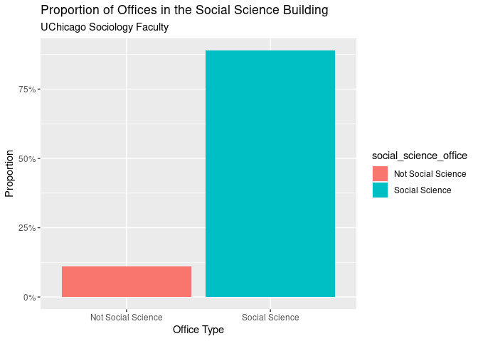
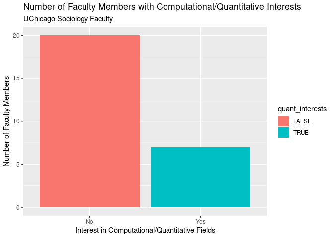
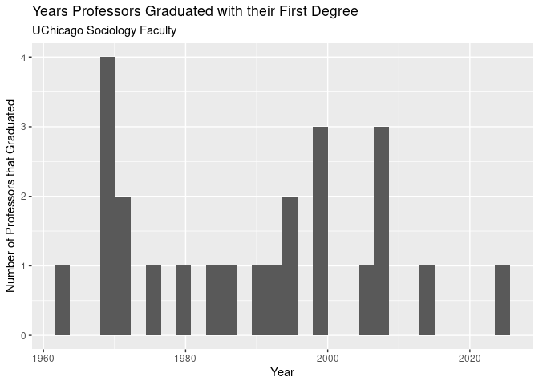
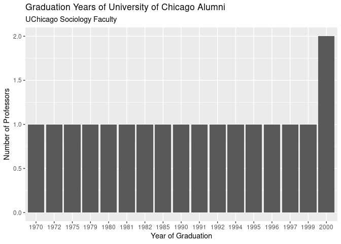

# Scraping Assignment

### Today we will be scraping information from the University of Chicago’s Sociology Faculty Directory.

Load necessary libraries.

    library(rvest)
    library(tidyverse)

    ## ── Attaching packages ─────────────────────────────────────── tidyverse 1.3.2 ──
    ## ✔ ggplot2 3.4.0     ✔ purrr   1.0.2
    ## ✔ tibble  3.2.1     ✔ dplyr   1.1.4
    ## ✔ tidyr   1.3.0     ✔ stringr 1.5.1
    ## ✔ readr   2.1.5     ✔ forcats 0.5.2
    ## ── Conflicts ────────────────────────────────────────── tidyverse_conflicts() ──
    ## ✖ dplyr::filter()         masks stats::filter()
    ## ✖ readr::guess_encoding() masks rvest::guess_encoding()
    ## ✖ dplyr::lag()            masks stats::lag()

    library(lubridate)

    ## Loading required package: timechange
    ## 
    ## Attaching package: 'lubridate'
    ## 
    ## The following objects are masked from 'package:base':
    ## 
    ##     date, intersect, setdiff, union

    library(stringr)
    library(readr)

We start by using the `read_html()` function from `rvest` to make a
connection with the URL of the first page of the website we want to
scrape, grab its HTML source code, and save it into R.

    page_one <- "https://sociology.uchicago.edu/people/faculty?title=all&name=A"
    page <- read_html(page_one)
    page

    ## {html_document}
    ## <html lang="en" dir="ltr">
    ## [1] <head>\n<meta http-equiv="Content-Type" content="text/html; charset=UTF-8 ...
    ## [2] <body class="page-node-22852 group-theme-teal path-node page-node-type-de ...

We can test out how to scrape the links to each faculty member’s
specific page by inspecting the document and finding the appropriate CSS
element. This will give us all of the instances of this element on the
first page.

    html_elements(page, "div.block-text h2 a")

    ## {xml_nodeset (2)}
    ## [1] <a href="/directory/Andrew-Abbott" target="_self">Andrew  Abbott</a>
    ## [2] <a href="/directory/Luc-Anselin" target="_self">Luc Anselin</a>

We need to find how each page we can click to go through the directory
differs from each other and iterate through each url that we paste
together using a base url called `page_diffs`, the consistent tag on
each page `?title=all&name=`, and the letters A-Z that appears at the
end of each url to signify that you’ve clicked through a subset of last
names by letter. We then append `page_diffs` (the main faculty page) to
the full vector of `page_urls` after the loop has completed.

    page_diffs <- "https://sociology.uchicago.edu/people/faculty"

    letters <- LETTERS

    page_urls <- vector("character", length(letters))
    page_urls

    ##  [1] "" "" "" "" "" "" "" "" "" "" "" "" "" "" "" "" "" "" "" "" "" "" "" "" ""
    ## [26] ""

    length(page_urls)

    ## [1] 26

    for (i in seq_along(letters)) {
      page_urls[i] <- paste0(page_diffs, "?title=all&name=", letters[i])
    }
    page_urls

    ##  [1] "https://sociology.uchicago.edu/people/faculty?title=all&name=A"
    ##  [2] "https://sociology.uchicago.edu/people/faculty?title=all&name=B"
    ##  [3] "https://sociology.uchicago.edu/people/faculty?title=all&name=C"
    ##  [4] "https://sociology.uchicago.edu/people/faculty?title=all&name=D"
    ##  [5] "https://sociology.uchicago.edu/people/faculty?title=all&name=E"
    ##  [6] "https://sociology.uchicago.edu/people/faculty?title=all&name=F"
    ##  [7] "https://sociology.uchicago.edu/people/faculty?title=all&name=G"
    ##  [8] "https://sociology.uchicago.edu/people/faculty?title=all&name=H"
    ##  [9] "https://sociology.uchicago.edu/people/faculty?title=all&name=I"
    ## [10] "https://sociology.uchicago.edu/people/faculty?title=all&name=J"
    ## [11] "https://sociology.uchicago.edu/people/faculty?title=all&name=K"
    ## [12] "https://sociology.uchicago.edu/people/faculty?title=all&name=L"
    ## [13] "https://sociology.uchicago.edu/people/faculty?title=all&name=M"
    ## [14] "https://sociology.uchicago.edu/people/faculty?title=all&name=N"
    ## [15] "https://sociology.uchicago.edu/people/faculty?title=all&name=O"
    ## [16] "https://sociology.uchicago.edu/people/faculty?title=all&name=P"
    ## [17] "https://sociology.uchicago.edu/people/faculty?title=all&name=Q"
    ## [18] "https://sociology.uchicago.edu/people/faculty?title=all&name=R"
    ## [19] "https://sociology.uchicago.edu/people/faculty?title=all&name=S"
    ## [20] "https://sociology.uchicago.edu/people/faculty?title=all&name=T"
    ## [21] "https://sociology.uchicago.edu/people/faculty?title=all&name=U"
    ## [22] "https://sociology.uchicago.edu/people/faculty?title=all&name=V"
    ## [23] "https://sociology.uchicago.edu/people/faculty?title=all&name=W"
    ## [24] "https://sociology.uchicago.edu/people/faculty?title=all&name=X"
    ## [25] "https://sociology.uchicago.edu/people/faculty?title=all&name=Y"
    ## [26] "https://sociology.uchicago.edu/people/faculty?title=all&name=Z"

    page_urls <- c(page_diffs, page_urls)
    page_urls[1:10]

    ##  [1] "https://sociology.uchicago.edu/people/faculty"                 
    ##  [2] "https://sociology.uchicago.edu/people/faculty?title=all&name=A"
    ##  [3] "https://sociology.uchicago.edu/people/faculty?title=all&name=B"
    ##  [4] "https://sociology.uchicago.edu/people/faculty?title=all&name=C"
    ##  [5] "https://sociology.uchicago.edu/people/faculty?title=all&name=D"
    ##  [6] "https://sociology.uchicago.edu/people/faculty?title=all&name=E"
    ##  [7] "https://sociology.uchicago.edu/people/faculty?title=all&name=F"
    ##  [8] "https://sociology.uchicago.edu/people/faculty?title=all&name=G"
    ##  [9] "https://sociology.uchicago.edu/people/faculty?title=all&name=H"
    ## [10] "https://sociology.uchicago.edu/people/faculty?title=all&name=I"

    is.character(page_urls)

    ## [1] TRUE

We need to set a base url of the absolute path of the directory for the
links to each faculty member’s page.

    base_url <- "https://sociology.uchicago.edu"

We need to scrape each faculty member’s specific page from each
letter-sorted page. We do this by setting up a `function(p)` that reads
the relative links of the element and its attribute `href` that makes it
a link and pastes it together with the base url we just created above.
We specify within the function that if the length of this relative link
is 0, to return null so we don’t get links that are just the base url.
We then initialize an empty list within which we iterate through each
page url that we created in the above code block and apply the function
to the urls at each index. We unlist the links we’ve just created and
find the unique values to make sure we only have one link per faculty
member. The output should be the link to every faculty member’s page in
the directory.

    links_all_pages <- function(p) {
      page <- read_html(p)
      relative_links <- page %>% 
        html_elements("div.block-text h2 a") %>%
        html_attr("href")
      if (length(relative_links) == 0) {
        return(NULL)
      }
      full_links <- paste0(base_url, relative_links)
      return(full_links)
    }

    all_links <- list()
    for (i in seq_along(page_urls)) {
      all_links[[i]] <- links_all_pages(page_urls[i])
    }

    all_links_combined <- unique(unlist(all_links, use.names = FALSE))

    all_links_combined

    ##  [1] "https://sociology.uchicago.edu/directory/Andrew-Abbott"      
    ##  [2] "https://sociology.uchicago.edu/directory/Luc-Anselin"        
    ##  [3] "https://sociology.uchicago.edu/directory/Joyce-Bell"         
    ##  [4] "https://sociology.uchicago.edu/directory/Neil-Brenner"       
    ##  [5] "https://sociology.uchicago.edu/directory/terry-n-clark"      
    ##  [6] "https://sociology.uchicago.edu/directory/Elisabeth-S-Clemens"
    ##  [7] "https://sociology.uchicago.edu/directory/James-A-Evans"      
    ##  [8] "https://sociology.uchicago.edu/directory/Rene-D-Flores"      
    ##  [9] "https://sociology.uchicago.edu/directory/Marco-Garrido"      
    ## [10] "https://sociology.uchicago.edu/directory/Andreas-Glaeser"    
    ## [11] "https://sociology.uchicago.edu/directory/Julian-Go"          
    ## [12] "https://sociology.uchicago.edu/directory/Kimberly-Kay-Hoang" 
    ## [13] "https://sociology.uchicago.edu/directory/zahra-khoshk-jan"   
    ## [14] "https://sociology.uchicago.edu/directory/Karin-Knorr-Cetina" 
    ## [15] "https://sociology.uchicago.edu/directory/bernard-koch"       
    ## [16] "https://sociology.uchicago.edu/directory/John-Levi-Martin"   
    ## [17] "https://sociology.uchicago.edu/directory/Omar-McRoberts"     
    ## [18] "https://sociology.uchicago.edu/directory/Stephen-Raudenbush" 
    ## [19] "https://sociology.uchicago.edu/directory/Kristen-Schilt"     
    ## [20] "https://sociology.uchicago.edu/directory/Ross-M-Stolzenberg" 
    ## [21] "https://sociology.uchicago.edu/directory/Jenny-Trinitapoli"  
    ## [22] "https://sociology.uchicago.edu/directory/Robert-Vargas"      
    ## [23] "https://sociology.uchicago.edu/directory/Linda-Waite"        
    ## [24] "https://sociology.uchicago.edu/directory/Geoffrey-Wodtke"    
    ## [25] "https://sociology.uchicago.edu/directory/Kazuo-Yamaguchi"    
    ## [26] "https://sociology.uchicago.edu/directory/yueran-zhang"       
    ## [27] "https://sociology.uchicago.edu/directory/Linda-Zhao"

Ensure each link is unique with no duplicates.

    all_links_combined <- unique(all_links_combined)
    all_links_combined

    ##  [1] "https://sociology.uchicago.edu/directory/Andrew-Abbott"      
    ##  [2] "https://sociology.uchicago.edu/directory/Luc-Anselin"        
    ##  [3] "https://sociology.uchicago.edu/directory/Joyce-Bell"         
    ##  [4] "https://sociology.uchicago.edu/directory/Neil-Brenner"       
    ##  [5] "https://sociology.uchicago.edu/directory/terry-n-clark"      
    ##  [6] "https://sociology.uchicago.edu/directory/Elisabeth-S-Clemens"
    ##  [7] "https://sociology.uchicago.edu/directory/James-A-Evans"      
    ##  [8] "https://sociology.uchicago.edu/directory/Rene-D-Flores"      
    ##  [9] "https://sociology.uchicago.edu/directory/Marco-Garrido"      
    ## [10] "https://sociology.uchicago.edu/directory/Andreas-Glaeser"    
    ## [11] "https://sociology.uchicago.edu/directory/Julian-Go"          
    ## [12] "https://sociology.uchicago.edu/directory/Kimberly-Kay-Hoang" 
    ## [13] "https://sociology.uchicago.edu/directory/zahra-khoshk-jan"   
    ## [14] "https://sociology.uchicago.edu/directory/Karin-Knorr-Cetina" 
    ## [15] "https://sociology.uchicago.edu/directory/bernard-koch"       
    ## [16] "https://sociology.uchicago.edu/directory/John-Levi-Martin"   
    ## [17] "https://sociology.uchicago.edu/directory/Omar-McRoberts"     
    ## [18] "https://sociology.uchicago.edu/directory/Stephen-Raudenbush" 
    ## [19] "https://sociology.uchicago.edu/directory/Kristen-Schilt"     
    ## [20] "https://sociology.uchicago.edu/directory/Ross-M-Stolzenberg" 
    ## [21] "https://sociology.uchicago.edu/directory/Jenny-Trinitapoli"  
    ## [22] "https://sociology.uchicago.edu/directory/Robert-Vargas"      
    ## [23] "https://sociology.uchicago.edu/directory/Linda-Waite"        
    ## [24] "https://sociology.uchicago.edu/directory/Geoffrey-Wodtke"    
    ## [25] "https://sociology.uchicago.edu/directory/Kazuo-Yamaguchi"    
    ## [26] "https://sociology.uchicago.edu/directory/yueran-zhang"       
    ## [27] "https://sociology.uchicago.edu/directory/Linda-Zhao"

We need to create a function that scrapes each of these links, so we use
`lapply()` on the links and the function that operates on the urls. We
need to inspect the document for each element that we are interested.
The elements we are scraping in this function include the faculty
members’ names, emails, offices, titles (such as Associate Professor),
education background, and listed interests. All of this information is
available on each faculty members’ specific page. For some of the
elements, such as office, we need to get rid of a prefix (e.g. Office:
418), which we can easily do by using the regular expression
`sub("Office:\\s*", "", .)` to get rid of the prefix followed by any
white space. Because Joyce Bell does not have education background
listed on her page, we need to create an exception where if the length
of the education element scraped from the url is 0, to assign education
as `Not listed`. We then create a tibble where we assign each of the
elements to a variable and return the tibble. We then need to bind the
rows of this tibble by the name of the professor. Our output is the
tibble of scraped data we created.

    faculty_data <- lapply(all_links_combined, function(url) {
      # Scrapes data from UChicago Sociology department faculty website
      # Args: 
      #   url (string): each faculty member's page
      # Returns:
      #   tibble containing name, email, office, and interests of each faculty member
      page <- read_html(url)
      
      name <- html_elements(page, "span.bio-name") %>% 
        html_text2()
      email <- html_elements(page, "span.bio-email a") %>% 
        html_attr("href") %>% 
        sub("mailto:", "", .)
      office <- html_elements(page, "span.bio-location") %>% 
        html_text2() %>% 
        sub("Office:\\s*", "", .)
      title <- html_elements(page, "div.bio-subtitle") %>% 
        html_text2()
      education <- html_elements(page, "span.bio-sidenote") %>% 
        html_text2()
      interests <- html_elements(page, "span.bio-interest p") %>% 
        html_text2()
      
      if (length(education) == 0) {
        education <- "Not listed"
      }
      
      url_data <- tibble(
        name = name,
        email = email,
        office = office,
        title = title,
        education = education,
        interests = interests)
      return(url_data)
    })

    faculty_df <- bind_rows(faculty_data) %>%
      distinct(name, .keep_all = TRUE)
    faculty_df

    ## # A tibble: 27 × 6
    ##    name                 email                   office title education interests
    ##    <chr>                <chr>                   <chr>  <chr> <chr>     <chr>    
    ##  1 Andrew Abbott        aabbott@uchicago.edu    Socia… Gust… "B.A. Ha… Professi…
    ##  2 Luc Anselin          anselin@uchicago.edu    Socia… Stei… "B.S. Vr… Spatial …
    ##  3 Joyce Bell           jmbell@uchicago.edu     Kelly… Asso… "Not lis… Race, so…
    ##  4 Neil Brenner         neilbrenner@uchicago.e… Socia… Lucy… "B.A. Su… Critical…
    ##  5 Terry N. Clark       t-clark@uchicago.edu    Socia… Prof… "B.A. Bo… Using de…
    ##  6 Elisabeth S. Clemens clemens@uchicago.edu    Socia… Will… "B.A. Ha… Politica…
    ##  7 James A. Evans       jevans@uchicago.edu     Socia… Max … "B.A. Br… Knowing,…
    ##  8 René D. Flores       renedf@uchicago.edu     Socia… Asso… "B.A. Un… Immigrat…
    ##  9 Marco Garrido        garrido@uchicago.edu    Socia… Asso… "B.A. Ha… Politica…
    ## 10 Andreas Glaeser      a-glaeser@uchicago.edu  Socia… Prof… "B.A. Eb… Cultural…
    ## # ℹ 17 more rows

We then need to write the tibble to a csv and then read it.

    write_csv(faculty_df, "faculty_data.csv")
    faculty_data <- read_csv("faculty_data.csv")

    ## Rows: 27 Columns: 6
    ## ── Column specification ────────────────────────────────────────────────────────
    ## Delimiter: ","
    ## chr (6): name, email, office, title, education, interests
    ## 
    ## ℹ Use `spec()` to retrieve the full column specification for this data.
    ## ℹ Specify the column types or set `show_col_types = FALSE` to quiet this message.

    faculty_data

    ## # A tibble: 27 × 6
    ##    name                 email                   office title education interests
    ##    <chr>                <chr>                   <chr>  <chr> <chr>     <chr>    
    ##  1 Andrew Abbott        aabbott@uchicago.edu    Socia… Gust… "B.A. Ha… Professi…
    ##  2 Luc Anselin          anselin@uchicago.edu    Socia… Stei… "B.S. Vr… Spatial …
    ##  3 Joyce Bell           jmbell@uchicago.edu     Kelly… Asso… "Not lis… Race, so…
    ##  4 Neil Brenner         neilbrenner@uchicago.e… Socia… Lucy… "B.A. Su… Critical…
    ##  5 Terry N. Clark       t-clark@uchicago.edu    Socia… Prof… "B.A. Bo… Using de…
    ##  6 Elisabeth S. Clemens clemens@uchicago.edu    Socia… Will… "B.A. Ha… Politica…
    ##  7 James A. Evans       jevans@uchicago.edu     Socia… Max … "B.A. Br… Knowing,…
    ##  8 René D. Flores       renedf@uchicago.edu     Socia… Asso… "B.A. Un… Immigrat…
    ##  9 Marco Garrido        garrido@uchicago.edu    Socia… Asso… "B.A. Ha… Politica…
    ## 10 Andreas Glaeser      a-glaeser@uchicago.edu  Socia… Prof… "B.A. Eb… Cultural…
    ## # ℹ 17 more rows

Clean the data by separating the list of interests of each faculty
member into a column per interest, by separating faculty office listings
into the building and the room number, and by separating education into
the different degrees earned and when they were earned.

    faculty_data_semi_clean <- faculty_data %>%
      separate(interests, into = c("interest_1", 
                                   "interest_2", 
                                   "interest_3", 
                                   "interest_4", 
                                   "interest_5",
                                   "interest_6",
                                   "interest_7",
                                   "interest_8",
                                   "interest_9",
                                   "interest_10",
                                   "interest_11"), 
               sep = ",\\s*|;\\s*|\\s+and\\s+|\\s*&\\s*", 
               remove = TRUE, 
               fill = "right") %>% 
      separate(office, into = c("building", "room_number"), 
               sep = "(?<=\\D)(?=\\d)", 
               remove = TRUE) %>% 
      separate(education, into = c("first_degree", "second_degree", "third_degree"), 
               sep = "\n\r", 
               remove = TRUE)

    ## Warning: Expected 11 pieces. Additional pieces discarded in 2 rows [4, 7].

    ## Warning: Expected 3 pieces. Additional pieces discarded in 2 rows [2, 10].

    ## Warning: Expected 3 pieces. Missing pieces filled with `NA` in 5 rows [3, 15, 19, 22,
    ## 26].

    faculty_data_clean <- faculty_data_semi_clean %>%
      separate(first_degree, into = c("degree_one", "year_one"),
               sep = "(?<=\\D)(?=\\d)", remove = TRUE, fill = "right") %>%
      separate(second_degree, into = c("degree_two", "year_two"),
               sep = "(?<=\\D)(?=\\d)", remove = TRUE, fill = "right") %>%
      separate(third_degree, into = c("degree_three", "year_three"),
               sep = "(?<=\\D)(?=\\d)", remove = TRUE, fill = "right") %>% 
      mutate(across(starts_with("degree"), ~ na_if(., "Not listed"))) %>%
      mutate(across(starts_with("year"), ~ na_if(., "Not listed")))

    faculty_data_clean

    ## # A tibble: 27 × 22
    ##    name          email building room_number title degree_one year_one degree_two
    ##    <chr>         <chr> <chr>    <chr>       <chr> <chr>      <chr>    <chr>     
    ##  1 Andrew Abbott aabb… "Social… 313         Gust… "B.A. Har… 1970     " M.A. Un…
    ##  2 Luc Anselin   anse… "Social… 421         Stei… "B.S. Vri… 1975     " M.S. Vr…
    ##  3 Joyce Bell    jmbe… "Kelly " 104         Asso…  <NA>      <NA>      <NA>     
    ##  4 Neil Brenner  neil… "Social… 422         Lucy… "B.A. Sum… 1991     " M.A., G…
    ##  5 Terry N. Cla… t-cl… "Social… 321         Prof… "B.A. Bow… 1962     " M.A. Co…
    ##  6 Elisabeth S.… clem… "Social… 323         Will… "B.A. Har… 1980     " M.A. Un…
    ##  7 James A. Eva… jeva… "Social… 420         Max … "B.A. Bri… 1994     " M.A. St…
    ##  8 René D. Flor… rene… "Social… 424         Asso… "B.A. Uni… 2007     " M.A. Pr…
    ##  9 Marco Garrido garr… "Social… 405         Asso… "B.A. Har… 2000     " M.A. Un…
    ## 10 Andreas Glae… a-gl… "Social… 401 D-E     Prof… "B.A. Ebe… 1985     " M.A. Eb…
    ## # ℹ 17 more rows
    ## # ℹ 14 more variables: year_two <chr>, degree_three <chr>, year_three <chr>,
    ## #   interest_1 <chr>, interest_2 <chr>, interest_3 <chr>, interest_4 <chr>,
    ## #   interest_5 <chr>, interest_6 <chr>, interest_7 <chr>, interest_8 <chr>,
    ## #   interest_9 <chr>, interest_10 <chr>, interest_11 <chr>

For our first visualization, we want to see if faculty members in the
Sociology department at UChicago are likely to have offices in the same
building. From a quick look at the tibble, it appears that many
professors have their offices in the Social Sciences building, so I
mutated a new column in the tibble and used an `ifelse()` statement
alongside `startsWith` to list an office as Social Science if the
building name observation started with the string “social sciences”. I
then found the proportion of the offices by grouping the dataset by the
social\_science\_office column and counting the occurrences of each
category. I then visualized these proportions using ggplot with x as the
categorized social\_science\_office column and y as the proportion we
just calculated. A bar plot is best because we are using categorical
variables, and the proportion variable is a numerical representation of
how much each category contributes to the total. We use
`scale_y_continuous()` to convert the y axis into percentages. The
output is a bar plot that reveals that faculty members are far more
likely to have an office in the Social Science building (about 90% of
professors) than not (about 10% of professors).

    faculty_data_clean <- faculty_data_clean %>%
      mutate(social_science_office = 
               ifelse(startsWith(tolower(building), "social science"), 
                      "Social Science", "Not Social Science"))

    office_proportions <- faculty_data_clean %>%
      count(social_science_office) %>%
      mutate(proportion = n / sum(n))

    ggplot(office_proportions, 
           aes(x = social_science_office, 
               y = proportion, 
               fill = social_science_office)) +
      geom_bar(stat = "identity") +
      scale_y_continuous(labels = scales::percent) +
      labs(
        title = "Proportion of Offices in the Social Science Building",
        subtitle = "UChicago Sociology Faculty",
        x = "Office Type",
        y = "Proportion"
      )

For our second visualization, we want to see which faculty members’
interests align with computational and quantitative methods. This will
help students using quantiative methods in their search process for
advisors. A vector of keywords (“computational” and “quantitative”) is
defined to search for faculty interests that mention these terms. We
then extract all columns in faculty\_data\_clean that start with
“interest\_” and iterate over each of these columns, converting the text
to lowercase and replacing NA values with an empty string.
`str_detect()` checks if any of the keywords (“computational” or
“quantitative”) appear in each interest using a regular expression. We
then count how many interest\_ columns contain the keywords by
converting this to a binary variable (TRUE or FALSE) indicating if at
least one match was found. We then group the data by the
quant\_interests column and count the number of faculty members in each
group. We then create a bar plot to show the number of faculty members
with and without computational/quantitative interests with the x axis
detailing if they have these interests or not and the y axis detailing
the number of professors. Far more professors do not have these
interests than do, with 20 faculty members not having these interests
listed and about 7 having these interests listed.

    quant_keywords <- c("computational", "quantitative")

    faculty_data_clean <- faculty_data_clean %>%
      mutate(quant_interests = rowSums(
        select(., starts_with("interest_")) %>%
          sapply(function(x) str_detect(tolower(ifelse(is.na(x), "", x)), 
                                        paste(quant_keywords, collapse = "|"
                                              )))) > 0)

    faculty_data_clean$quant_interests

    ##  [1] FALSE  TRUE FALSE FALSE FALSE FALSE  TRUE  TRUE FALSE FALSE FALSE FALSE
    ## [13] FALSE FALSE  TRUE  TRUE FALSE  TRUE FALSE FALSE FALSE FALSE FALSE FALSE
    ## [25] FALSE FALSE  TRUE

    faculty_data_clean

    ## # A tibble: 27 × 24
    ##    name          email building room_number title degree_one year_one degree_two
    ##    <chr>         <chr> <chr>    <chr>       <chr> <chr>      <chr>    <chr>     
    ##  1 Andrew Abbott aabb… "Social… 313         Gust… "B.A. Har… 1970     " M.A. Un…
    ##  2 Luc Anselin   anse… "Social… 421         Stei… "B.S. Vri… 1975     " M.S. Vr…
    ##  3 Joyce Bell    jmbe… "Kelly " 104         Asso…  <NA>      <NA>      <NA>     
    ##  4 Neil Brenner  neil… "Social… 422         Lucy… "B.A. Sum… 1991     " M.A., G…
    ##  5 Terry N. Cla… t-cl… "Social… 321         Prof… "B.A. Bow… 1962     " M.A. Co…
    ##  6 Elisabeth S.… clem… "Social… 323         Will… "B.A. Har… 1980     " M.A. Un…
    ##  7 James A. Eva… jeva… "Social… 420         Max … "B.A. Bri… 1994     " M.A. St…
    ##  8 René D. Flor… rene… "Social… 424         Asso… "B.A. Uni… 2007     " M.A. Pr…
    ##  9 Marco Garrido garr… "Social… 405         Asso… "B.A. Har… 2000     " M.A. Un…
    ## 10 Andreas Glae… a-gl… "Social… 401 D-E     Prof… "B.A. Ebe… 1985     " M.A. Eb…
    ## # ℹ 17 more rows
    ## # ℹ 16 more variables: year_two <chr>, degree_three <chr>, year_three <chr>,
    ## #   interest_1 <chr>, interest_2 <chr>, interest_3 <chr>, interest_4 <chr>,
    ## #   interest_5 <chr>, interest_6 <chr>, interest_7 <chr>, interest_8 <chr>,
    ## #   interest_9 <chr>, interest_10 <chr>, interest_11 <chr>,
    ## #   social_science_office <chr>, quant_interests <lgl>

    quant_interests_summary <- faculty_data_clean %>%
      group_by(quant_interests) %>%
      summarize(count = n())

    quant_interests_summary

    ## # A tibble: 2 × 2
    ##   quant_interests count
    ##   <lgl>           <int>
    ## 1 FALSE              20
    ## 2 TRUE                7

    ggplot(quant_interests_summary,
           mapping = aes(x = quant_interests, 
                         y = count, 
                         fill = quant_interests)) +
      geom_bar(stat = "identity") +
      scale_x_discrete(labels = c("No", "Yes")) +
      labs(
        title = "Number of Faculty Members with Computational/Quantitative Interests",
        subtitle = "UChicago Sociology Faculty",
        x = "Interest in Computational/Quantitative Fields",
        y = "Number of Faculty Members")

We then want the names of the faculty members who have quantitative
interests, so we filter based on the binary variable of if it is true
that the professors have quantitative interests and select the name of
the professor. This will help students using quantitative methods even
more in their search for advisors.

    faculty_with_quant_interests <- faculty_data_clean %>%
      filter(quant_interests == 1) %>%
      select(name)

    faculty_with_quant_interests

    ## # A tibble: 7 × 1
    ##   name              
    ##   <chr>             
    ## 1 Luc Anselin       
    ## 2 James A. Evans    
    ## 3 René D. Flores    
    ## 4 Bernard Koch      
    ## 5 John Levi Martin  
    ## 6 Stephen Raudenbush
    ## 7 Linda Zhao

We then want to find two different types of titles professors can have
at UChicago - Associate Professor and Assistant Professor - to see
professors of different ranks in the hierarchy. We filter for each of
these titles using a regular expression to see if there are matches to
each title type in the title column, ignoring case. We then print the
names of these professors by using a `$` after the new dataset name.

    associate_professors <- faculty_data_clean %>%
      filter(str_detect(title, regex("Associate Professor", ignore_case = TRUE)))

    associate_professors$name

    ## [1] "Joyce Bell"     "René D. Flores" "Marco Garrido"  "Omar McRoberts"
    ## [5] "Kristen Schilt"

    assistant_professors <- faculty_data_clean %>%
      filter(str_detect(title, regex("Assistant Professor", ignore_case = TRUE)))

    assistant_professors$name

    ## [1] "Zahra Khoshk Jan" "Bernard Koch"     "Yueran Zhang"     "Linda Zhao"

I then filtered for faculty members’ graduation years from their first
degree using the variables from the `year_one` column, and knowing the
observations in this column are characters, I looked for years that were
lower than the string of 1970. I then printed the names of the
professors. I then calculated the mean of the year professors earned
their first degree by mutating the `year_one` column to be numeric, then
taking the mean of the column and removing NA values. I then visualized
this mean by filtering out the NA values in the column and using the
numeric version of the `year_one` column as the x value. I then plotted
using a histogram. This plot visualizes the years professors in the
Sociology department at UChicago graduated with their first degree, and
we can see a peak a bit before 1970.

    old_professors <- faculty_data_clean %>% 
      filter(year_one < "1970")
    old_professors$name

    ## [1] "Terry N. Clark"      "Stephen Raudenbush"  "Ross M. Stolzenberg"
    ## [4] "Linda Waite"

    mean_year_one <- faculty_data_clean %>% 
      mutate(year_one = as.numeric(year_one)) %>%
      summarize(mean_year_one = mean(year_one, na.rm = TRUE))
    mean_year_one 

    ## # A tibble: 1 × 1
    ##   mean_year_one
    ##           <dbl>
    ## 1         1989.

    faculty_data_clean %>%
      filter(!is.na(year_one)) %>%
      ggplot(mapping = aes(
             x = as.numeric(year_one))) +
      geom_histogram() +
      labs(
        title = "Years Professors Graduated with their First Degree",
        subtitle = "UChicago Sociology Faculty",
        x = "Year",
        y = "Number of Professors that Graduated")

    ## `stat_bin()` using `bins = 30`. Pick better value with `binwidth`.

I then wanted to see what years faculty members working at UChicago that
are also alumni of UChicago graduated with any degree. To do this, I
filtered the degree columns using a regular expression to look for
instances of “University of Chicago”, ignoring cases, and found the
names of the alumni. I then selected the necessary variables and mutated
the years to be integers. I then bound the rows, filtering out NA
values, and renamed each year column as the same variable,
`graduation_year`. I then visualized these graduation years using
ggplot, where I filtered out NA values in the new graduation year column
and took x as this column, then generated a bar plot. This bar plot
shows the years in which the alumni graduated, with a slight peak in
2000 with two alumni graduating.

    uchicago_alum <- faculty_data_clean %>%
      filter(str_detect(degree_one, regex("University of Chicago", ignore_case = TRUE)) |
             str_detect(degree_two, regex("University of Chicago", ignore_case = TRUE)) |
             str_detect(degree_three, regex("University of Chicago", ignore_case = TRUE)))
    uchicago_alum$name

    ## [1] "Andrew Abbott"        "Neil Brenner"         "Elisabeth S. Clemens"
    ## [4] "Julian Go"            "Omar McRoberts"       "Kazuo Yamaguchi"

    uchicago_alum_years <- uchicago_alum %>%
      select(name, degree_one, year_one, degree_two, year_two, degree_three, year_three) %>%
      mutate(
        year_one = as.integer(year_one),
        year_two = as.integer(year_two),
        year_three = as.integer(year_three)
      ) %>%
      bind_rows(
        uchicago_alum %>% 
          select(name, year_one) %>% 
          filter(!is.na(year_one)) %>% 
          rename(graduation_year = year_one),
        uchicago_alum %>% 
          select(name, year_two) %>% 
          filter(!is.na(year_two)) %>% 
          rename(graduation_year = year_two),
        uchicago_alum %>% 
          select(name, year_three) %>% 
          filter(!is.na(year_three)) %>% 
          rename(graduation_year = year_three))

    ggplot(uchicago_alum_years %>% 
             filter(!is.na(graduation_year)), 
           aes(x = graduation_year)) +
      geom_bar() +
      labs(
        title = "Graduation Years of University of Chicago Alumni",
        subtitle = "UChicago Sociology Faculty",
        x = "Year of Graduation",
        y = "Number of Professors")

### Sources

-   Debugged with ChatGPT in the pre-scraping process because pages are
    sorted by letter instead of page numbers.
-   Debugged the regular expressions while scraping each element with
    ChatGPT.
-   Debugged the regular expression using an unspecified function in the
    second visualization using ChatGPT.
-   Debugged the regular expressions to figure out how to either ignore
    the case or to convert strings to lower case using ChatGPT.
